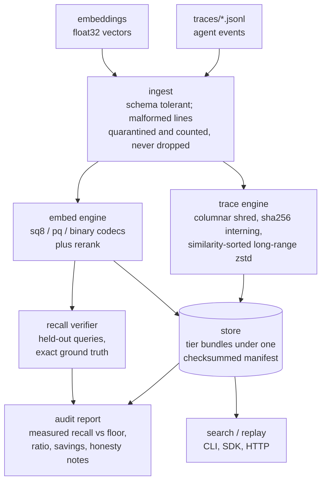

# DENSITY

**The flight recorder for AI agents.** DENSITY ingests the JSONL traces and
embedding vectors your agents already write, compresses them with bit-level
techniques, and stores them in tiers defined by a *measured recall floor*.

[](https://github.com/vineetsista/density/actions/workflows/ci.yml)
[](https://www.python.org/downloads/)
[](LICENSE)

You do not buy a compression ratio. You buy a retrieval quality you can check,
on your own data, before you trust it.

Version 0.1.0, pre-1.0: the storage formats and the SDK surface can still
change. Where this README says "v1" it means the v1 format contract, not a
released 1.0.

## The problem

An agent platform writes an enormous and extraordinarily redundant archive:
the same 3 KB system prompt resent on every model call, retry storms of
near-identical tool invocations, and one fp32 embedding per chunk sitting in a
vector database priced by the gigabyte-month. Teams respond by deleting
history, which is the one thing a flight recorder must never do.

Generic compression is blind to that structure. And the tools that are not
blind still cannot answer the only question that matters: *if I move this to a
cheaper tier, what does my retrieval quality actually become?*

DENSITY answers it by measuring. Every tier is a contract, a recall floor at a
footprint target, and the recall verifier holds real queries out of your
corpus, computes exact ground truth, and prints the measured number next to
the floor. When a tier misses, the audit says so and recommends the tier above
it.

## The tier model

| Tier | Contents | Recall floor (checked per corpus) | Footprint target |
|------|----------|-----------------------------------|------------------|
| HOT  | Original fp32 vectors, full traces | Exact by definition | 1.0x |
| WARM | int8 vectors, deduped and similarity-packed columnar traces at zstd-10 | recall@10 >= 0.99 vs HOT | <= 0.25x |
| COLD | PQ or binary vectors with rerank, the same trace bundle at zstd-19 | recall@10 >= 0.95 (PQ) or 0.90 (binary) | <= 0.08x |

The floors are what the audit checks, not a promise that every corpus clears
them. Recall depends on the corpus, which is the product's whole thesis: the
same SQ8 codec measures 0.9930 on one fixture here and 0.9877 on another, and
both numbers are printed rather than picked. See
[Limitations](#limitations-and-known-gaps).

COLD is a two-tier configuration. Its floor is measured with rerank through
the WARM int8 vectors (or HOT fp32 when present) over the identical id set,
which the default `--tiers warm,cold` gives you. A cold-only store searches
without rerank, the floor does not apply, and the store warns saying exactly
that.

## Install

```bash
git clone https://github.com/vineetsista/density
cd density

pip install -e .                   # Python 3.11+, no compiler needed
pip install -e ".[accel]"          # add the compiled C++20 kernels
pip install -e ".[service]"        # add the HTTP service (fastapi, uvicorn)
pip install -e ".[dev]" && pytest -q
```

Not on PyPI yet, so install from a clone. Linux and macOS: the audit uses the
POSIX `resource` module for peak-RSS accounting, so it does not run on
Windows.

The `accel` extra adds exactly one build-time dependency, `pybind11`. The
kernels compile on first import and cache under your user cache directory,
keyed by source, interpreter, compiler, and host CPU target. Every failure
mode degrades silently: a rejected `-march=native` retries with
portable flags, and no compiler or no pybind11 falls back to the numpy kernels,
which are always present and always correct. Check which path you got:

```bash
python -c "import density; print(density.ACCEL_ACTIVE)"
DENSITY_ACCEL_DEBUG=1 python -c "import density; density.ACCEL_ACTIVE"  # why not
DENSITY_ACCEL_DISABLE=1 ...                                            # force numpy
```

## Quickstart

```bash
density synth --gb 0.05 --out ./raw        # a realistic agent corpus, seeded
density audit ./raw --out report.html      # compress, measure recall, price it
density compress ./raw                     # build ./raw.density, no report
density search ./raw.density "user asked about a refund" -k 10
density replay ./raw.density <trace_id>    # the original events, in order
density bench --quick                      # smoke-run the benchmark harness
```

`audit` reads a raw corpus directory. `search` and `replay` read a store
directory, which is what `compress` builds, so `compress` comes first. The
text query above goes through a deliberately limited demo embedder, not a
semantic model: see [Text search](#text-search). The CI smoke job runs this
block against a clean, non-editable wheel install, at a smaller corpus size and
with the outputs captured, so a quickstart that stops working fails the build.

## The audit report is the product

`density audit` writes `report.html` (self-contained, inline CSS, no network)
and `report.md` beside it, with the same numbers in both.

- **Headline**: original size, best tier, its measured ratio, its measured
  recall@10, and projected monthly and yearly savings.
- **Tier guarantees**: per tier, the floor, the measured recall@10, a PASS or
  MISS verdict, the footprint target, the measured footprint, and the ratio.
  A MISS comes with a recommendation to move up a tier.
- **Compression breakdown**: traces, vectors, and total bytes per tier, beside
  the savings model.
- **Dedup**: near-duplicate cluster count, exact groups that genuinely share
  storage, bytes saved, the residual line rate, and the top clusters with
  samples.
- **Methodology**: the seed, the held-out query count, the database size, the
  rerank depths, the pricing constants, library versions, whether the compiled
  kernels were active, and per-stage wall times.
- **Honesty**: every guarantee that missed, every step that was skipped or
  sampled, and why.

Every compression ratio and every recall number in that report is measured on
your corpus. The dollar figures are a transparent model over two price
constants (`$0.023` per GB-month object storage, `$0.33` per GB-month vector
database) that you can override with a `pricing.toml`.

## How it works



One pipeline feeds every surface. The CLI, the Python SDK, and the local HTTP
service are thin wrappers over the same library calls.

| Module | What it does |
|---|---|
| `ingest/` | Streams JSONL traces and `.npy` / `.parquet` / `.jsonl` embeddings. Recognizes nine families of field-name aliases, preserves every unrecognized key verbatim, and quarantines malformed lines with counts instead of crashing. |
| `engine/trace/` | Shreds events into `structured.parquet` (dictionary-encoded strings, delta-packed microsecond timestamps, one int64 ref per payload) plus zstd block stores. Byte-identical payloads are sha256-interned to a single stored copy; unique payloads are packed similarity-sorted so near-duplicate templates sit inside one 64 MB long-range zstd window. Anything the canonical form cannot reproduce keeps its raw bytes in a residual store and wins at replay. |
| `engine/embed/` | SQ8 (per-dimension affine int8), PQ (k-means++ warm start, full-batch Lloyd, then anisotropic score-aware refinement), binary sign codes, exact and SQ8 rerankers, Matryoshka truncation. |
| `engine/_accel/` | C++20 kernels for SQ8 scoring, PQ ADC scan, and hamming scan, built lazily through pybind11, with numpy fallbacks that agree to 1e-5 and reject the same invalid input message for message. |
| `recall/` | The referee. Leave-out query split, exact float64 ground truth, recall@1/10/100 per codec. Every recall number in this repo comes from here. |
| `tiers/` | Tier specs, the store directory, and one manifest recording a sha256 for every file it references. |
| `audit/` | The end-to-end ceremony: ingest, compress each tier, cluster duplicates, verify recall, re-verify round-trip byte equality on a sample, price it, render the report. |
| `bench/` | The deterministic corpus generator and the public benchmark harness. |
| `service/` | FastAPI wrappers over the SDK. |

### Byte-exact replay

The non-negotiable property: `unshred` reproduces every input line
byte-for-byte, in original order, including malformed lines, CRLF endings,
lone surrogates, and lines serialized with non-canonical spacing. A row stores
no residual only when re-serializing its canonical event reproduces the
original bytes exactly. Every audit re-checks this on a 1 percent sample of
the real corpus, and the test suite checks it at 100 percent on small corpora.

### The synthetic corpus

`density synth` is not filler. The trace stream is a global time-ordered merge
over concurrent session lanes, so consecutive events of one conversation land
megabytes apart, past what a plain zstd window can reach. System prompts are
per-conversation compositions of a shared persona base plus injected session
context, resent byte-identically on every call. Message bodies are template
plus slots drawn from wide seeded spaces, so boilerplate repeats while payload
details never do. It includes retry storms, Poisson-bursty timestamps, about 2
percent malformed lines, unicode and emoji, and occasional 50 KB tool outputs.

Embeddings are a low-rank manifold mixture, because real sentence encoders
concentrate near manifolds of intrinsic dimension roughly 10 to 40 and carry
heavy near-duplicate mass. An isotropic full-rank blob would make every recall
number here meaningless.

## Python SDK

```python
import density

with density.open("./mystore.density") as store:
    store.put_traces("./raw/traces", tier="cold")        # one batched call per tier
    store.put_embeddings(ids, vectors, tier="warm")      # int8, 0.99 floor

    store.set_embedder(my_model.encode)                  # configure before any str query

    hit_ids, scores = store.search(query_vector, k=10)   # original ids, not row indices
    events = store.replay(trace_id)                      # parsed original events, in order
    raw = store.replay_raw(trace_id)                     # the exact original line bytes
    mismatched = store.verify()                          # re-hash every checksummed file

result = density.audit("./raw")                          # AuditResult, JSON via .to_dict()
stats = density.synth(0.05, out="./raw")                 # the corpus generator
```

`put_traces` defaults to the COLD tier and `put_embeddings` to WARM. In v1 each
tier takes exactly one `put_traces` and one `put_embeddings` call; a second
raises `StoreError` telling you to batch, because incremental re-encoding would
either drift the codebooks or force a full refit, and neither can be
re-verified without a fresh audit.

`replay` parses the original lines back into dicts. `replay_raw` is the one
that carries the byte-exactness guarantee.

### Text search

`density.embedders.HashingEmbedder` is a deterministic bag-of-words feature
hasher and is labeled demo-only in its own docstring. It exists so the demo
runs with no model, no network, and no GPU. It preserves coarse token overlap
and nothing more. Production text search means `store.set_embedder(fn)` with
the same model that produced the stored vectors; the honest path is
`store.search(vector)`.

## HTTP API

```bash
pip install -e ".[service]"
density serve ./raw.density            # binds 127.0.0.1:8377
```

| Method | Route | Body or query | Returns |
|---|---|---|---|
| `POST` | `/audit` | `{"path": str, "tiers": [str]?}` | `{"report_html", "report_md", "audit": <full AuditResult>}`; report written beside `path` |
| `GET` | `/search` | `?q=<json array or text>&k=10&tier=` | `{"ids": [...], "scores": [...]}` |
| `GET` | `/replay/{trace_id}` | | `{"trace_id": ..., "events": [...]}` |

```bash
curl 'http://127.0.0.1:8377/search?q=user%20asked%20about%20a%20refund&k=3'
curl 'http://127.0.0.1:8377/search?q=%5B0.1,0.2,0.3%5D&k=3'   # a JSON vector
curl "http://127.0.0.1:8377/replay/$TRACE_ID"
```

Every error is `{"error": {"type": ..., "message": ...}}`: 400 for bad input,
404 for an unknown trace, 500 for anything the server cannot produce (a corrupt
bundle, tiers loaded from different corpora, an unexpected bug), and never a
stack trace.

**There is no authentication.** `POST /audit` takes a filesystem path and
writes the report next to it; the CLI confines it to the served store's parent
directory, and paths resolving outside that root are rejected. Audit responses
embed 120-character samples of real content. This is a localhost development
surface. See [SECURITY.md](SECURITY.md).

## Benchmarks

Every number between the markers below is generated by
`scripts/update_readme_bench.py` from measured results in
[`benchmarks/results/`](benchmarks/results) (written by `density bench`).
Benchmark tables here are never typed by hand, and
`scripts/update_readme_bench.py --check` exits nonzero when the table drifts
from the newest results, which is what the `honesty` CI job enforces on every
push.

<!-- BENCH:START -->
Source: bench_full.json (mode full, seed 1337, machine: 12th Gen Intel(R) Core(TM) i7-1250U).
Vector corpus: 100000 synth vectors at dim 768, 1000 held-out queries, recall measured by the recall verifier against exact ground truth.

| Tier / codec | Reduction vs fp32 | recall@10 | Rerank depth | Search seconds |
|---|---:|---:|---:|---:|
| WARM / sq8 | 4.0x | 0.9877 | 0 | 26.716 |
| COLD / pq (ADC, m=192) | 15.4x | 0.8194 | 0 | 11.069 |
| COLD / pq (m=128) | 22.6x | 0.9877 | 200 | 7.616 |
| COLD / binary | 32.0x | 0.9877 | 500 | 2.991 |

Traces: 50.6x vs raw JSONL, 1.59x vs whole-file zstd level 19 (0.2 GB synth corpus, COLD settings).
Accel: ACCEL_ACTIVE=True; compiled kernel speedups sq8_scores 6.6x, pq_adc_scan 32.9x, hamming_scan 23.0x (n=1000000).
<!-- BENCH:END -->

The per-phase gate scripts under `scripts/` write
`benchmarks/results/phase*.json` the same way, each recording the machine and
the exact dependency versions it measured with.

### Reproducing them

```bash
pip install -e ".[dev]" -c benchmarks/measured-versions.txt   # as measured
density bench --quick                      # smoke configuration
density bench                              # the public matrix, tens of minutes
python scripts/update_readme_bench.py      # inject the table
python scripts/update_readme_bench.py --check
```

Full mode measures four codec configurations at dims 384 and 768 over 100,000
synthetic vectors with 1,000 held-out queries, a 0.2 GB trace corpus against
both raw bytes and whole-file `zstd -19`, and all three kernels over 1,000,000
rows. Results land in `benchmarks/results/bench_full.json`.

`benchmarks/measured-versions.txt` pins the exact dependency versions the
published numbers were measured with; the project itself declares lower bounds only, and every
result file records its own `versions` block regardless.

Recall numbers are seed-deterministic and reproduce exactly on the same
machine. Wall-clock timings are machine-dependent, and they differ materially
between the compiled and numpy kernel paths, which is why every result file
records `accel_active` next to them.

## Limitations and known gaps

[`GAPS.md`](GAPS.md) is the honest ledger. A missed target is recorded with its
measured value and never quietly lowered. Two are open:

- **COLD bundle vs whole-file zstd-19: 2.04x measured against a 2.5x target.**
  Measured on the 1 GB seeded corpus. Summing the per-component measured
  entropy floors, a perfect entropy coder on every column reaches about 2.18x,
  so the target is unreachable without parsing inside payloads. The honest
  next levers are semantic template mining and recency-model coding of the ref
  and trace_id streams, which is roadmap work rather than tuning.
- **SQ8 recall@10: 0.9877 measured against the 0.99 WARM floor** on the 100k
  standard corpus. Int8 per-dimension affine quantization carries a fixed
  score-noise floor near 3e-4 cosine, and at that corpus density a fraction of
  top-10 boundary gaps fall below it. The same codec measures 0.9930 on the
  sparser 5,000-vector audit fixture. This is exactly the situation the product
  exists to surface: the audit measures per corpus and recommends the higher
  tier when a floor is missed.

Scope limits and v1 constraints, all enforced by the code rather than only
documented:

- **The measured trace ratios assume canonical-form lines.** A line is stored
  columnar only when re-serializing its canonical event reproduces the original
  bytes exactly. Corpora with epoch-second or ISO timestamps, vendor field
  aliases, or a different key order fall to the residual path and compress
  closer to plain `zstd -19`. The audit reports the measured residual rate per
  corpus so you can tell which case you are in. Details in `GAPS.md`.
- One `put_traces` and one `put_embeddings` call per tier. No appends yet.
- `put_traces(tier="hot")` is rejected: HOT's contract is raw untouched files,
  and v1 does not build a raw passthrough bundle.
- A cold-only store searches without rerank and its recall floor does not
  apply. The store warns, naming the floor it cannot honor.
- A trace_id containing a lone surrogate is addressable only in escaped form.
- The audit holds the whole embedding matrix in memory, about 3.1 GB at the
  1M x 768 design point, and dedup retains one copy of each distinct content
  body plus one index per event. Traces are never held in memory.
- `HashingEmbedder` is a demo, not a semantic model.

## Determinism and privacy

- Every stochastic step takes `seed: int = 1337` and draws from
  `numpy.random.default_rng(seed)`. Same seed and same machine gives
  bit-identical corpora, bundles, codec fits, and manifests. PQ fits are
  bit-identical across worker counts, pinned by a test.
- Manifests store codec state as one `.npy` per array rather than `.npz`,
  because the zip container embeds timestamps and would make checksums noise.
- Corpus identity in the manifest is a content sha256, not a path, so
  manifests stay byte-identical across build directories.
- The audit's only nondeterministic outputs are `stage_seconds` and
  `peak_rss_mb`, isolated in exactly two fields so you can strip them and diff
  the rest.
- The compiled and numpy kernels accumulate in different orders, so at an exact
  score tie the two paths can select different members of the tied set. Every
  result file records which path produced it.
- **No network calls anywhere in the core library.** Not in ingest, not in the
  engine, not in the audit, not in the report (the HTML is self-contained, with
  no external CSS, fonts, or scripts). The only socket in the repo is the one
  `density serve` binds when you ask it to.

## Development

```bash
uv venv && source .venv/bin/activate
uv pip install -e ".[dev]"          # dev pulls in accel and service
pytest -q
ruff check .
python scripts/check_prose.py
```

Tests mirror the source tree. Property tests with hypothesis cover the SQ8
reconstruction error bound, ADC rank correlation against exact distances,
hamming symmetry, dedup normalization idempotence, and shred round-trip byte
equality. CI runs four jobs: the test matrix on Python 3.11, 3.12, and 3.13; lint plus a
prose check that fails on em and en dashes; the benchmark-table honesty check;
and a quickstart smoke test against a non-editable wheel, which is what catches
package data missing from the wheel.

See [CONTRIBUTING.md](CONTRIBUTING.md) and
[CODE_OF_CONDUCT.md](CODE_OF_CONDUCT.md) for the rules that are not negotiable,
[CHANGELOG.md](CHANGELOG.md) for what is in this release,
[DECISIONS.md](DECISIONS.md) for one line of rationale on every choice the spec
left open, and [`docs/design/`](docs/design) for the binding interface contract
and the phase plan. The most interesting entries in DECISIONS are 22 (refs as
item indices), 23 (similarity-sorted packing), and 26 (anisotropic PQ
training).

## Roadmap

- Capture-side adapters, so DENSITY reads from an agent framework directly
  instead of from files it already wrote.
- A timestamp-unit tag and key-order code, so non-canonical corpora stay off
  the residual path and keep the measured compression.
- Semantic template mining: extract slots from repeated payload templates into
  their own columns, the measured next lever on trace compression.
- Recency-model coding for the ref and trace_id streams; the ref stream is
  currently 13 percent above its zero-order entropy.
- Percentile-clipped or per-block SQ8 scales, which would change the codec
  format and so belongs to a version, not a patch.
- Incremental appends with re-verification, so a store can grow without a full
  refit.
- `index.json` metadata compaction.
- Matryoshka truncation on the audit API (it is on the store API today).
- KV-cache compression (`engine/kv/`): not in v1.

## License

MIT. See [LICENSE](LICENSE).
